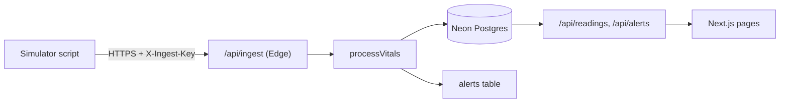

| Route / module | Role |
|----------------|------|
| `POST /api/ingest` | Edge validation, rules, insert `readings`, optional `alerts` + `processing_events` |
| `GET /api/readings` | Authenticated time series for dashboard |
| `GET/PATCH /api/alerts` | List / mark read |
| `GET /api/medications` | List (UI also uses Server Components + actions) |
| `GET /api/cron/medication-rollover` | Bearer `CRON_SECRET`; reports overdue count |
| `(app)/dashboard` | Polling vitals UI |
| `(app)/alerts`, `(app)/medications` | In-app notifications & schedules |
| `/thesis` | Public mapping to thesis chapters |
